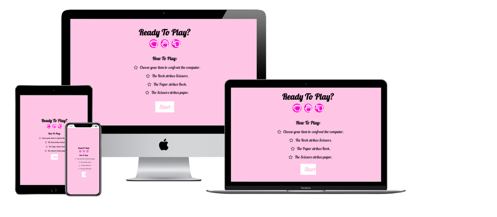
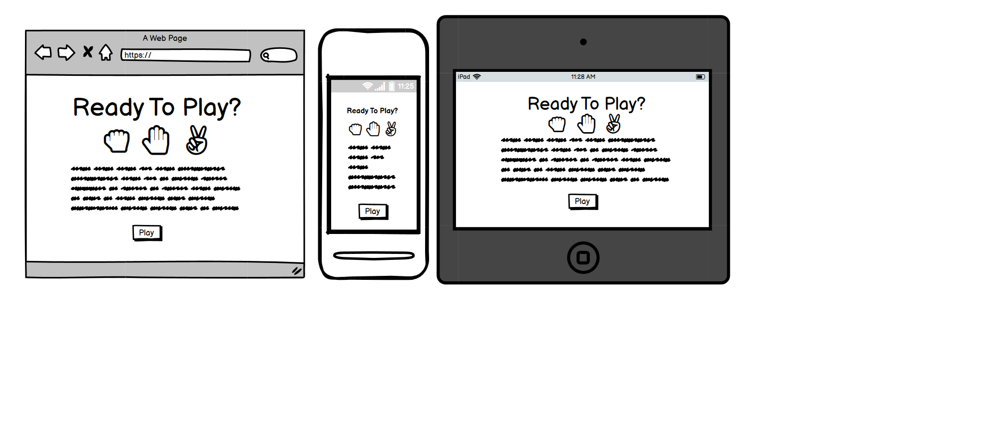
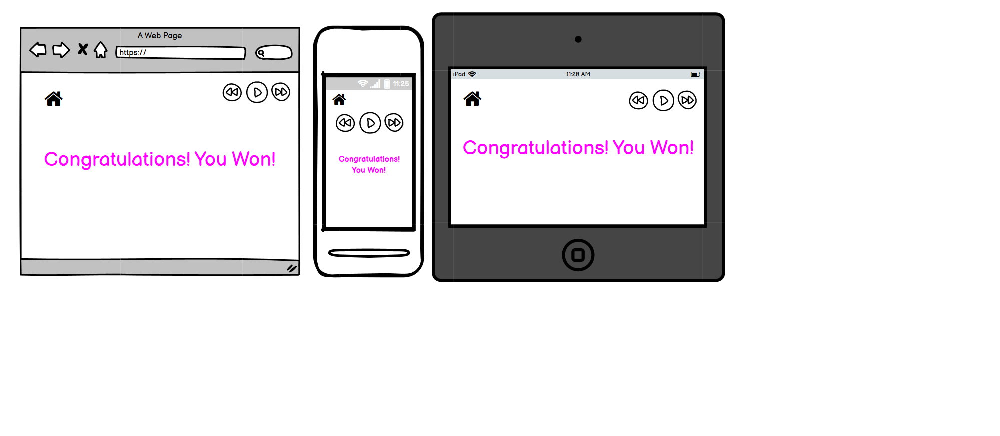
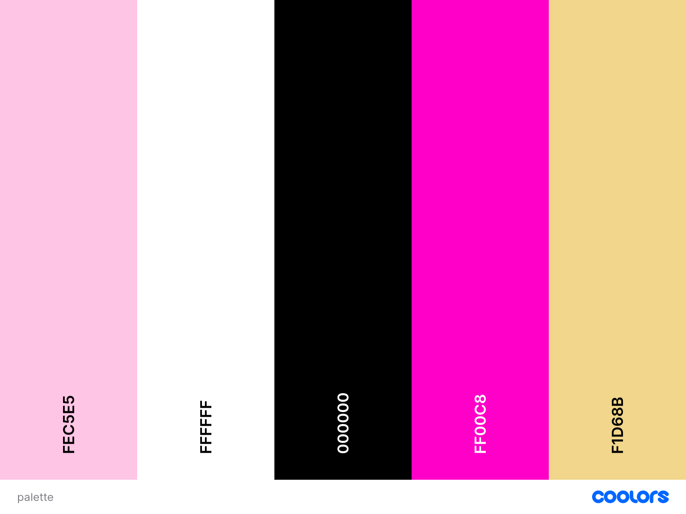
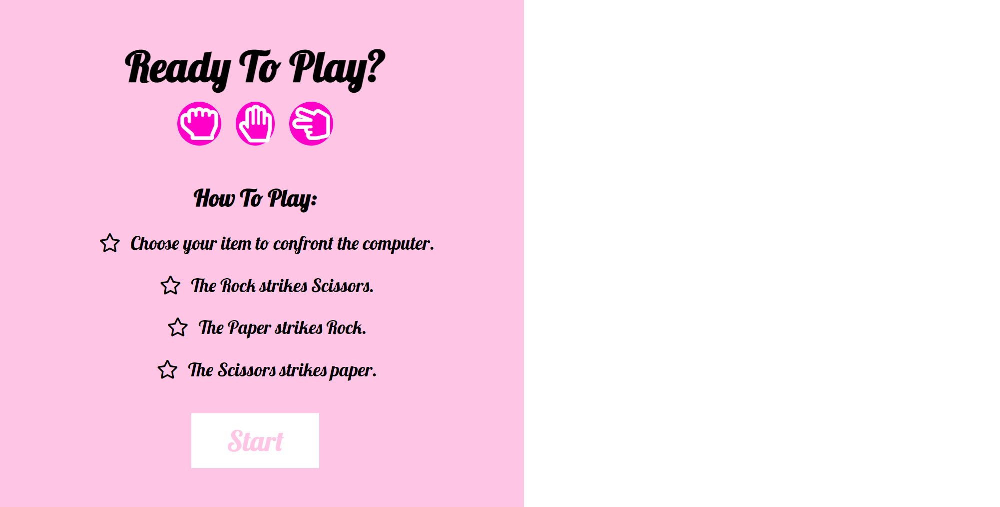
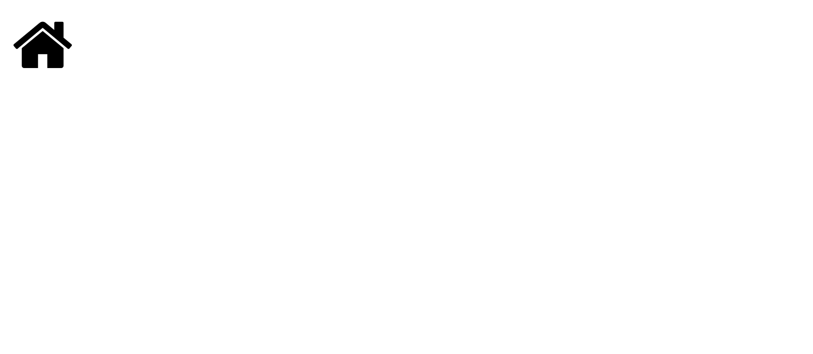
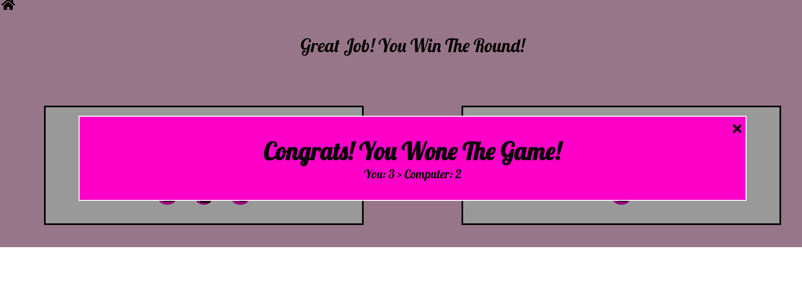
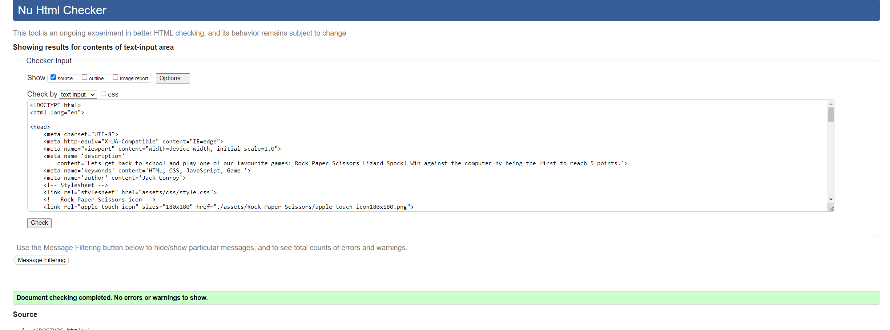
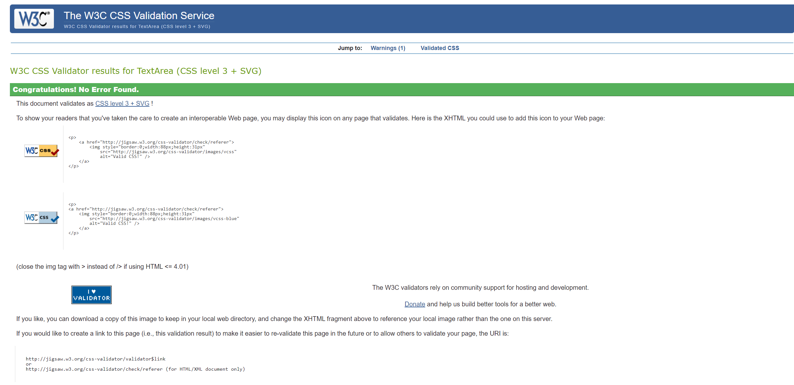
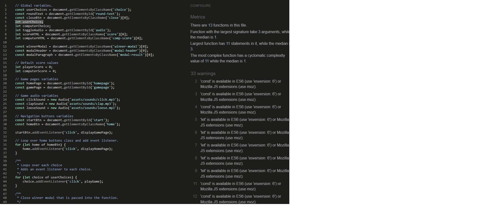

# Rock Paper Scissors
## Portfolio Project 2: Rock, Paper, Scissors Game – Code Institute
## 1. Purpose of the project
This project aimed to build a web-based version of the famous Rock, Paper, Scissors game. The languages used to build the game were HTML, CSS, and JavaScript. Users will need to choose rock, paper, or scissors to reach 3 points and beat the opponent. The target audience would be people of all ages looking for fun and playing a quick game.

 
Link to the Project:  https://van-essa.github.io/Rock-Paper-Scissors-Project2/
 
## 2. User Stories
In this section, the usage of its page is explained.
 
### Home Page
This section will allow the visiting user to understand the rules of the games quickly, and if interested, click on the start button to land on the game page and start playing.
 
### Game Page
This section will allow the visiting user:
- Start Playing
- See her/his score progress and understanding if (s)he won the round.
- Look at the computer's (opponent) score and understand if (s)he is losing the round.
- Notify her/him of the round winner.
- Notify her/him who won or lost the game.
- Turn the game notification sounds on and off.
- Navigate across all devices without and back to the home page via the 'Home' button.
 
## 3. Strategy
The strategy of the Rock Paper Scissors project was focused on creating a minimalistic but also colourful single page where the visiting user can easily navigate her/himself. The visiting user will get a simple but clear explanation about the game's rules, providing her/him with progress feedback throughout the game. Rock Paper Scissors aims to give the visiting user fun and simple game experience.
 
## 4. Scope
The visiting user will:
- Get instructions on how to play the game.
- Get a responsive design; namely, the game will function correctly across various devices such as Mobiles, Tablets, laptops and desktops.
- Get the option to turn off or on the audio during the gameplay.
- Get the navigation option visible and apparent.
 
## 5. Structure
- Colourful and simple settings will appear on the page to create a fun and clear user experience.
- A list of 'How To Play instructions are provided on the Home Page.
- The score will be visible for both the user and the opposer (computer) to keep track of the game's progress.
- At the end of the game, a message will pop up:
1. _Congrats! You Won The Game_ - When the visiting user won the game.
2. _You Lost The Game_ - When the visiting user lost the game.
- At the end of the game, an audio file will be played:
1. Clapping - If the visiting user won the game.
2. Alarm - If the visiting user lost the game.
- A Home icon will be available on the top left corner of the Game Page so the visiting user can revisit the Home Page.
- An Audio icon will be available on the top right corner of the Game Page so the visiting user can turn off/on the sound.
 
## 6. Skeleton
The wireframes were created using Balsamiq.

 
## 7. Surface
- Colours
The Shades of Pink Color inspired the scheme of the colours used for this project to give a fun and colourful feeling to the visiting user:

- Typography
The Typography used on the site was “Lobster” and “Sans-Serif” and was taken from [Google Fonts](https://fonts.googleapis.com/css2?family=Lato&family=Lobster&display=swapt)
- Image and Icons
The rock paper scissors image was taken from [Canva](www.canva.com), and the icons used in the Home and Game Pages were taken from [Font Awesome](www.fontawesome.com)
 
## 8. Technology
After studying the Javascript essentials course with Code Institute, this project was created in Git pod using HTML, CSS and Javascript languages.
 
## 9. Features
- Home Page
The Home page provides the visiting user with a playful and colourful approach to the rock paper scissors game, followed by the gameplay instructions and ending with a CTA *Play* button that links the visiting user to play the game. The features shown on the Home Page are to provide a clear understanding of the gameplay and provide a smooth and fun user experience.

 
- Game Page
The Game Page is where the visiting user is experiencing the game. The visiting user plays against the computer, where the winner is the one who wins three rounds. While playing, the visiting user gets informed about the status of each game:
1. _Great Job! You Win The Round!_ - When the visiting user wins the round
2. _It Is A Draw!_ - When the visiting user and the computer get a draw
3. _Oh, No! The Computer Wins The Round!_ - When the visiting user lose the round
The visiting user's score increments if (s)he is the round winner. If the visiting user loses a round, then the computer's score is incremented. The Game Page aims to make the game enjoyable and straightforward by providing the visiting user with the score progress of each round, understanding the game's status with notifications and the score status.
 
- Navigation
The Game Page provides a Home icon on the top left corner to allow the visiting user to return to the Home page. Thus the visiting user can navigate back to the home screen.

 
- Audio Button
The visiting user can choose whether to play the game with or without audio by clicking on the audio icon. The icon changes to a muted icon in yellow colour when clicked on. This feature aims to provide a great user experience where the visiting user can choose to have or not the game audio.
 
- Game Winner
When the visiting user or computer has reached a three score, a message will appear notifying the visiting user's status. If the visiting user has won the game, clapping sounds will play. If the visiting user lost the game, an alert sound would play. In addition, the final scores from both the visiting user and teh computer are visible to see the score difference.

 
- Testing
The project was tested in Google Chrome, Mozilla Firefox, Safari and Microsoft Edge, Apple iPhone and Apple tablet.
[W3C HTML validator](https://validator.w3.org/nu/#textarea) was used to validate the sites HTML. No Errors found.

[W3C CSS validator](https://jigsaw.w3.org/css-validator/validator) was used to validate the sites HTML. No Errors were found.

[JSHint JavaScript Validator](https://jshint.com/) was used to validate the site's Javascript. Even though 33 warnings were noticed in the validator, no issues were caused with the game's functionality.

 
- Bugs
1. My initial project was to create a quiz regarding what type of triathlete you are. Due to personal reasons, I did not manage to work on my project for more than two weeks. Since I was not active on Github for more than 14 days, all my work was deleted. After checking with Student Support, I realised that I could not do anything than start from scratch. I learned that from now on, every time I start with a project, I should pin it so I won't face a similar incident. Since my initial task was much more complicated and lacked time, I switched to the Rock Paper Scissors game project instead.
2. When you clicked on the game's paper icon, it did not function. After looking carefully at the code, I realised my mistake and corrected it.
3. The image at the end of the Game Page was misaligned in the mobile version and had to adjust the CSS code.
 
## 10. Deployment
The site was opened via Gitpud to check its process. The step to open that site is as follows:
 
- Go to terminal
- Git command: python3 -m HTTP.server
- A pop-up message will appear on the right-hand side where Open Browser should be clicked.
- A new page opens where the site is available.
 
The site was deployed to GitHub pages. The steps to deploy are as follows:
- Log into GitHub
- In the GitHub repository, navigate to the Settings tab
- Select the repository for the Code-Next project
- Navigate to and click on 'Settings.'
- When the page has redirected, navigate to 'GitHub Pages' and proceed to click on the link
- Select branch to 'Main' from sources dropdown
- Click the generated link to the live site: https://van-essa.github.io/Rock-Paper-Scissors-Project2/
 
## 11. Credits
Content
- Instructions on how to implement the HTML and CSS code using GitHub was taken from the HTML, CSS and Javascript course from Code Institute
 
Media
- The image on the Game page is from [Canva](www.canva.com)
- The icons in the footer were taken from [Font Awesome](www.fontawesome.com)
- The sounds in the gameplay were taken from [Mixkit](https://mixkit.co/free-sound-effects/)
 

